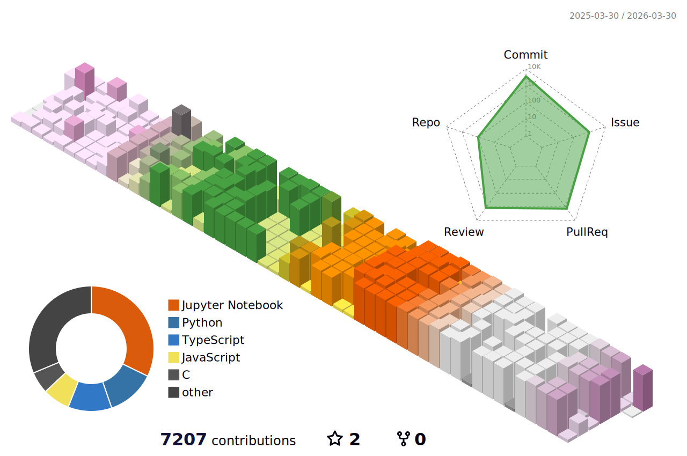

# 🚀 maton's Portfolio

こんにちは、**maton** です。毎日楽しくエンジニアライフやってます。

---

## 🐍 A Snake That Eats My Contribution Grass

<picture>
  <source media="(prefers-color-scheme: dark)" srcset="https://raw.githubusercontent.com/obregonia1/obregonia1/master/img/snake-dark.svg">
  <source media="(prefers-color-scheme: light)" srcset="https://raw.githubusercontent.com/obregonia1/obregonia1/master/img/snake.svg">
  
</picture>

## 🌐 SNS & Contact

---

## 🧠 Skills

  

---

## 🛠️ Projects

### 🎯 HackFlow -博路‐

> ハッカソンでの「開発の過程」にフォーカスした、共有プラットフォーム。

🔹 プロジェクト登録と可視化  
🔹 チームメンバー管理 & フィードバック機能  
🔹 完成物ではなく「プロセス」に価値を

🔗 [本番環境](https://hack-flow-c486eda020a0.herokuapp.com)  
📂 [GitHub Repo](https://github.com/maton369/HackFlow)

---

### 💡 EmoLog

> 「感情ログ」に注目したジャーナリング・アプリ。ハッカソンプロジェクト。

📂 [GitHub Repo](https://github.com/Tech-Education-CAMP-Hackathon/EmoLog)

---

## 📈 GitHub Stats

  
  
  
  
  

---

## 📊 Languages Used

  

---

## 🏅 Achievements

  

---

