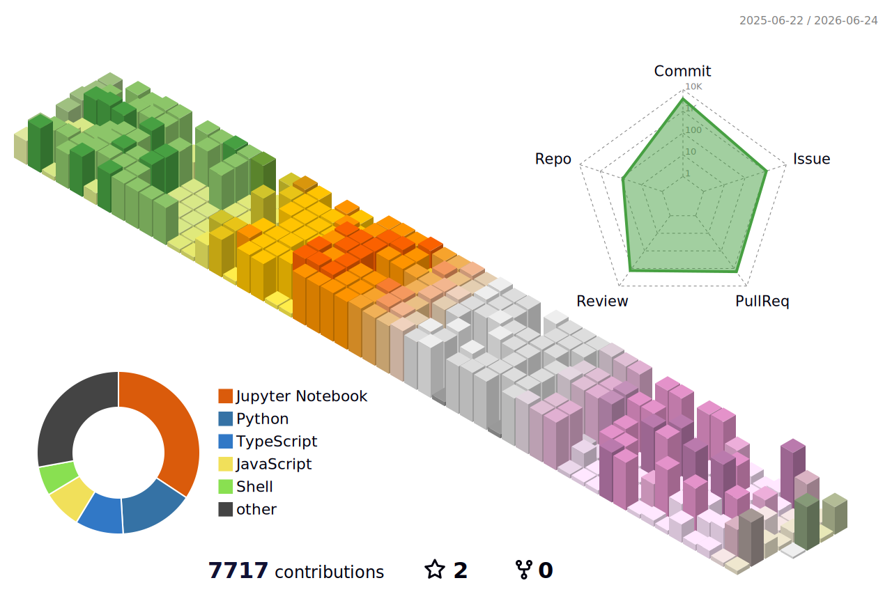

# 🚀 maton's Portfolio

こんにちは、***maton*** です。毎日楽しくエンジニアライフやってます。

---

## 🐍 A Snake That Eats My Contribution Grass

<picture>
  <source media="(prefers-color-scheme: dark)" srcset="https://raw.githubusercontent.com/obregonia1/obregonia1/master/img/snake-dark.svg">
  <source media="(prefers-color-scheme: light)" srcset="https://raw.githubusercontent.com/obregonia1/obregonia1/master/img/snake.svg">
  
</picture>

## 🌐 SNS & Contact

[読書メーター](https://bookmeter.com/users/1511026)

[Gitty](https://gitty-code.com/user/maton369)

---

## 🧠 Skills

  

---

## 🛠️ Projects

### 🎯 HackFlow -博路‐

> ハッカソンでの「開発の過程」にフォーカスした、共有プラットフォーム。

🔹 プロジェクト登録と可視化  
🔹 チームメンバー管理 & フィードバック機能  
🔹 完成物ではなく「プロセス」に価値を

🔗 [本番環境](https://hack-flow-c486eda020a0.herokuapp.com)  
📂 [GitHub Repo](https://github.com/maton369/HackFlow)

---

### 💡 EmoLog

> 「感情ログ」に注目したジャーナリング・アプリ。ハッカソンプロジェクト。

📂 [GitHub Repo](https://github.com/Tech-Education-CAMP-Hackathon/EmoLog)

---

### リマインドBot

> 毎週の部の活動の告知を手作業だったのをBotで自動化し部員の作業の負担を軽減しました

[CTRL_Schedule_Bot](https://github.com/TCU-CTRL/CTRL_Schedule_Bot)

---

## 🪟Intern

>[プライム上場/Tech企業【JavaScript×AI挑戦！0→1のWebアプリ開発／就業型3weeks有償インターン】顔画像判定APIを活用した新規サービス開発](https://talent.supporterz.jp/events/a5dc5b9d-20d1-410d-8bfb-9da72dd377b9/)
>
>[Works Human Intelligence インターン2025 開発課題](https://github.com/c0b231008b/WHI-intern-2025)
>
> [ログラス5daysインターンシップ｜27卒 エンジニア職【本選考直結】](https://loglass.notion.site/5days-27-1b2da7df897980249953c90923c37bce)
>
> [【27卒｜エンジニア職】※2週間 就業型インターンシップ※ KADOKAWAグループにて運営するサービスの開発を一緒に手掛けませんか？](https://talent.supporterz.jp/events/3e79d8a4-eaa7-4f42-a625-c2ed31ab7cef/)
>
>[バイブコーディングで最高の生産性を実現するサマーインターン！エンジニア募集](https://herp.careers/v1/monox/A2dpZ2cq5sC3)

## 📈 GitHub Stats

  
  
  
  
  

---

## 📊 Languages Used

  

---

## 🏅 Achievements

  

---

